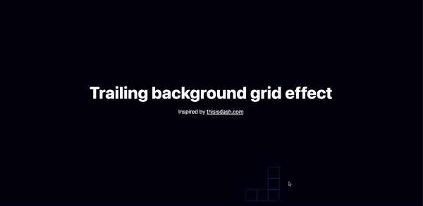

# Trailing Hover Grid Effect

A React-based grid component with a trailing hover effect, built with **Tailwind CSS**. This project demonstrates a modern, interactive UI feature suitable for portfolios, landing pages, or any project aiming for a visually engaging user experience.

This effect takes inspiration from the designs at [DASH](https://thisisdash.com/), combining clean, responsive styling with interactive hover elements.



## Features

- **Trailing Hover Effect**: Smoothly animates elements based on mouse position.
- **Responsive Design**: Built with Tailwind CSS, making it adaptable to different screen sizes.
- **Lightweight and Simple**: Minimal setup with essential dependencies.

## Getting Started

This project was bootstrapped with [Create React App](https://github.com/facebook/create-react-app).

### Installation

1. Clone the repository:

   ```bash
   git clone https://github.com/RP-90/Trailing-Hover-Grid.git
   ```

2. Navigate into the project directory:

   ```bash
   cd trailing-hover-grid
   ```

3. Install the dependencies:

   ```bash
   npm install
   ```

4. Start the development server:

   ```bash
   npm start
   ```

   The app will be running at [http://localhost:3000](http://localhost:3000).

## Available Scripts

In the project directory, you can run:

- ### `npm start`

  Runs the app in the development mode. The page will reload when you make changes. You may also see any lint errors in the console.

- ### `npm test`

  Launches the test runner in the interactive watch mode.  
  See the section about [running tests](https://facebook.github.io/create-react-app/docs/running-tests) for more information.

- ### `npm run build`

  Builds the app for production to the `build` folder. It correctly bundles React in production mode and optimizes the build for the best performance.

- ### `npm run eject`

  **Note: this is a one-way operation. Once you `eject`, you can't go back!** This command will remove the single build dependency from your project.

## Usage

- Hover over the grid squares to see the trailing effect in action.
- Customize colors and grid size by modifying the component in `src/Components/HoverGrid.js`.

## Technologies

- **React**: JavaScript library for building user interfaces.
- **Tailwind CSS**: Utility-first CSS framework for rapid UI development.

## Demo

To see a live demo, hover over the grid squares to observe the trailing effect.


## License

This project is open source and available under the [MIT License](./LICENSE).

## Learn More

You can learn more in the [Create React App documentation](https://facebook.github.io/create-react-app/docs/getting-started).

To learn React, check out the [React documentation](https://reactjs.org/).

**Tags**: `React`, `Tailwind CSS`, `Hover Effect`, `UI Animation`, `Interactive Grid`, `JavaScript`, `CSS`